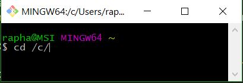
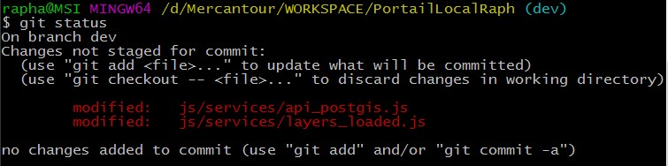
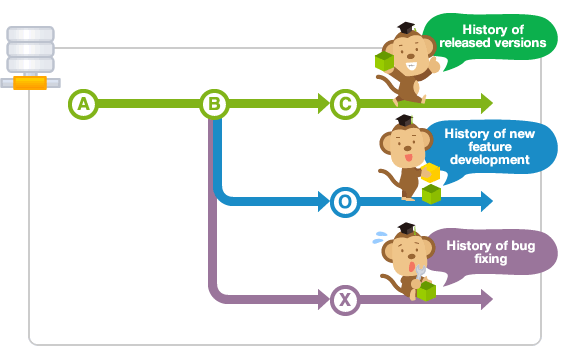

## Mémo Git et GitHub
###### Dernière modif tuto : 04/06/2016

### 0 - Liens utiles
* [Tutos vidéos Grafikart](https://www.grafikart.fr/formations/git) : Excellents tutos vidéos couvrant une grosse partie des fonctions de git
<br>
* [Tutos vidéos Grafikart - Déployer comme un pro avec git](https://www.grafikart.fr/blog/deployer-site-git) : Pour le déploiement entre environnement de dev et de prod sur deux serveurs différents (tuto qui a servi de base pour le déploiement dev/prod de Geonature au PNM)

### 1 - Installation
##### Environnement : Partie local sur Windows et distant principalement sur Debian 8

L'installation de git sur Windows est de loin la plus foireuse de toutes. Il va nous falloir installer git en utilisant l'executable fournit sur [git-scm.com](https://git-scm.com/download/win). Lors de l'installation il faudra bien faire attention à cocher l'option afin d'obtenir les commande UNIX dans le PATH de notre système. Cette option nous permettra par la suite de profiter de certaines commandes linux sans avoir à utiliser un terminal spécial.
<br>
Après installation et pour les futures commandes à lancer, on utilisera le shell de git (git bash dans windows) :
<br>


### 2 - Configuration générale

Première chose à faire après installation propre sur son poste de travail :
```
	git config --global user.name "MON_NOM"
	git config --global user.email "MON_EMAIL_RATTACHÉ_A_MON_COMPTE_GITHUB"
	git config --global color.ui auto
	git config --global core.autocrlf true
```
* Les deux premiers paramètres permettent d’identifier l’auteur des commits avec son nom et son adresse mail (cette dernière doit être identique à celle rensignée sur son compte GitHub perso).
* Le troisième permet d’activer la colorisation de la sortie en ligne de commande, cependant elle ne parait plus nécessaire, puisque ce serait maintenant le comportement par défaut à l’installation (pour une installation sur environnement Windows uniquement).
* La quatrième permet de convertir les retours-chariots pour le système UNIX (donc nécessaire uniquement sous environnement Windows)

<br>

Si à l’installation nous avons choisi d’importer dans le git bash les commandes de bases unix, alors nous pouvons ensuite nous en servir comme dans Linux pour se déplacer par exemple dans l’arborescence de nos projets :
```
	cd /c/Mercantour/WORKSPACE
```

### 3 - Initialisation d'un projet
Pour initialiser un nouveau projet, ou même un projet commencé de longue date mais non "gité", rien de plus simple
On peut créer le répertoire, ou bien si le projet est déjà existant s'y déplacer :
```
	mkdir mon_projet
	cd mon_projet
	git init
```
Création du répertoire du projet, puis initialisation de Git à l’intérieur de celui-ci afin de commencer à tracker toutes modifications.

### 4 - Commandes de bases utiles
Liste et détail de quelques commandes que j'utilise assez régulièrement, et d'autres moins souvent et qui requiert justement un mémo :

<br>
#### Commandes généralistes


Une commande qu'on oublie trop souvent quand on ne se rappel plus le nom ou la fonction d'une commande
```
	git --help
```

***

Pour initialiser git dans le répertoire courant
```
	git init
```

***

Pour télécharger un projet et tout son historique de versions
```
	git clone [url ou chemin vers le dossier si en local]
```

<br>
#### Effectuer des modifications...


Cette commande va nous retourner l’état des fichiers que track Git, afin de savoir s’il faut que nous fassions un commit. Ci-dessous, deux fichiers ont été modifiées :
```
	git status
```
<br>


***

Permet d'ajouter TOUS les fichiers au suivi de version de git (A effectuer dés que l'on modifie ou ajoute un fichier dans notre répertoire de travail). Sans ça, les fichiers ne seront pas inclus aux éventuels futurs commits.
On peut remplacer le ``.`` par le nom exact du ou des fichiers que l'on veut ajouter (Cela peut par exemple permettre de décomposer nos commits).
```
	git add .
```

***

Permet de commiter nos fichiers et donc d'effectuer un instantané de notre répertoire de travail, de façon permanente dans l'historique de version de git.
A noter que pour être effectué, il faut avoir au préalable ajouté des fichiers au suivi avec ``git add`` OU ajouter le paramètre ``-a`` juste avant le ``-m``.
```
	git commit -m "Commit initial - Ici on entre le texte que l'on veut"
```

***

Pour montrer les modifications non indexées sur les fichiers
```
	git diff
```

***

Pour montrer les différences de fichier entre la version indexée et la dernière version
```
	git diff --staged
```

***

Si nous voulons rectifier le dernier commit fait car nous avons oublié d’y ajouter un fichier modifié nous pouvons le faire avec la commande ``git commit --amend``
Cela nous ouvre alors le dernier commit avec l’éditeur de texte par défaut (vi). Nous pouvons alors le modifier puis à nouveau le soumettre.
```
	git commit -m "Mon commentaire initial"
	git add fichier_oublie
	git commit --amend
```

***

Pour enlever le fichier de l'index, mais conserve son contenu
```
	git reset [fichier]
```

***

<br>
#### Supprimer un commit


Si après avoir fait un commit nous nous rendons compte que nous avons fait une erreur ou omis de spécifier un changement, nous pouvons aussi annuler ce commit en le supprimant, et en utilisant une commande spécifique. Cette commande permet aussi de supprimer plusieurs commit à la volée.<br>
:boom: :bangbang: <span style="color: #fb4141">**Cependant, il faut faire attention à ne supprimer que des commentaires qui n’ont pas encore été envoyés vers un serveur distant (push) où d’autres personnes sont susceptibles de travailler dessus.**</span> :bangbang: :boom:

```
	git reset [le SHA-1 abrégé du commentaire précédent celui (ou ceux) que nous voulons supprimer]
```

Afin de récupérer le SHA-1 abrégé nous pouvons lancer la commande suivante :

```
	git log –-abbrev-commit
```

Ou de façon plus simple en utilisant « ungit », le SHA-1 abrégé est ici directement présenté :
<br>


***

:boom: :bangbang: <span style="color: #fb4141">**ATTENTION**</span> :bangbang: :boom:
<span style="color: #fb4141">**Supprime tout l'historique et les modifications effectuées après le commit spécifié**</span>
```
	git reset --hard [le SHA-1 abrégé du commentaire précédent celui (ou ceux) que nous voulons supprimer]
```

***


<br>
#### Les branches


<br>

<br>

Pour lister toutes les branches locales dans le dépôt courant
```
	git branch
```

***

Pour créer une nouvelle branche
```
	git branch [nom-de-branche]
```

***

Pour basculer sur la branche spécifiée et met à jour le répertoire de travail (et ça c'est magique !)
```
	git checkout [nom-de-branche]
```

***

Pour supprimer la branche spécifiée
Si la branche est "pleine" ou n'a pas été fusionnée avec une autre, alors il faudra utiliser ``git branch -D [nom-de-branche]``
**Attention on perdra toutes les modifications qui y ont été effectuées !**
```
	git branch -d [nom-de-branche]
```

***

Pour fusionner dans la branche courante l'historique de la branche spécifiée
```
	git merge [nom-de-branche]
```

***

<br>
#### Changements au niveau des noms de fichiers


:point_right: Commandes de base en console Linux, mais avec Git :point_left:

***

Pour supprimer le fichier du répertoire de travail et met à jour l'index
```
	git rm [fichier]
```

***

Pour supprimer le fichier du système de suivi de version mais le préserve localement.
A comparer avec ``git reset [fichier]`` ?! Pas encore testé !
```
	git rm --cached [fichier]
```

***

Pour renommer le fichier et prépare le changement pour un commit
```
	git mv [fichier-nom] [fichier-nouveau-nom]
```

***

<br>
#### Vérifier l'historique des versions


Pour montrer l'historique des versions pour la branche courante
```
	git log
```

***

Pour montrer l'historique des versions, y compris les actions de renommage, pour le fichier spécifié
```
	git log --follow [fichier]
```

***


Pour montrer les différences de contenu entre deux branches
```
	git diff [premiere-branche]...[deuxieme-branche]
```

***

Pour montrer les modifications de métadonnées et de contenu inclues dans le commit spécifié
```
	git show [commit]
```

***

<br>
#### Branches distantes, synchronisations, etc...


Pour ajouter une connexion distante, que ce soit un serveur en SSH, ou un dépôt GitHub comme ici :
```
	$ git remote add github https://github.com/RaphaelChochon/documentations.git
```

***

Pour récupèrer tout l'historique du dépôt nommé.<br>
```
	git fetch [nom-de-depot]
```

***

Pour fusionner la branche du dépôt dans la branche locale courante
```
	git merge [nom-de-depot]/[branche]
```

***

Pour envoyer tous les commits de la branche locale vers GitHub
```
	git push [alias] [branche]
```

***

Pour récupèrer tout l'historique du dépôt nommé et incorpore les modifications
```
	git pull [alias] [branche]
```

***

Pour sélectionner un commit quelconque et l'appliquer sur la branche actuelle
```
	git cherry-pick d42c389f
```
Nécéssite au préalable d'avoir fait un ``fetch`` si on veut picorer depuis un dépôt distant

***


<br>
#### Ajout d'une release, d'un "tag", d'une étiquette...


L'étiquette la plus utilisée, est l'étiquette annotée. Elle s'apparente à un numéro de version de l'appli ou du dépôt.
Pour lister les tags d'un dépôt :
```
	git tag
```
Pour filtrer les tags :
```
	git tag -l 'v1.8.5*'
```

***

Pour créer un tag sur son dépôt :
```
	git tag -a v1.0.0 -m 'ma version 1.4'
```
On peut visualiser les données de l’étiquette à côté du commit qui a été marqué en utilisant la commande ``git show``.

***

Pour étiquetter après coup :
```
	$ git log --pretty=oneline
	15027957951b64cf874c3557a0f3547bd83b3ff6 Fusion branche 'experimental'
	a6b4c97498bd301d84096da251c98a07c7723e65 Début de l'écriture support
	0d52aaab4479697da7686c15f77a3d64d9165190 Un truc de plus
	6d52a271eda8725415634dd79daabbc4d9b6008e Fusion branche 'experimental'
	0b7434d86859cc7b8c3d5e1dddfed66ff742fcbc ajout d'une fonction de validatn
	4682c3261057305bdd616e23b64b0857d832627b ajout fichier afaire
	166ae0c4d3f420721acbb115cc33848dfcc2121a début de l'ecriture support
	9fceb02d0ae598e95dc970b74767f19372d61af8 mise à jour rakefile			<-- On a oublié de taguer
	964f16d36dfccde844893cac5b347e7b3d44abbc validation afaire
	8a5cbc430f1a9c3d00faaeffd07798508422908a mise à jour lisezmoi
```
Si on veut étiquetter au niveau de "mise à jour rakefile" alors :
```
	git tag -a v1.2 9fceb02
```

***

Enfin, pour "pusher" un tag, il ya une méthode particulière :
```
	git push github [nom-du-tag]
```

<br>
#### Résoudre des conflits


:soon:


<br><br><br><br>
###### Source
* [Doc officielle](https://github.com/github/training-kit/blob/master/downloads/fr/github-git-cheat-sheet.md) : Inspiration de la doc officielle en :fr: et ajout de ma part
<br>
