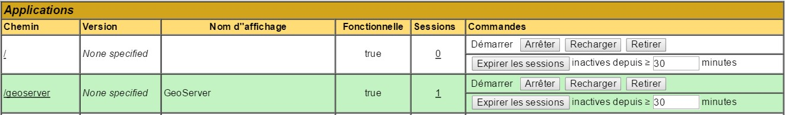

## Installation et configuration de Geoserver 2.8.3
##### Environnement : Debian 8
###### Dernière modif tuto : 11/04/2016


### 1 - Pré-requis
#### 1.1 - Installation de l’environnement Java 7 (JRE)
```
	apt-get update
	apt-get install openjdk-7-jre
```

#### 1.2 - Installation de Tomcat7
```
	apt-get install tomcat7 tomcat7-admin
```

#### 1.3 - Création user Tomcat
Création d'un user de connexion pour le manager web de Tomcat
Pour cela, édition du fichier ``tomcat-users.xml`` de cette manière : ``sudo nano /etc/tomcat7/tomcat-users.xml``
```
	<role rolename="manager-gui"/>
	<user username="MON_USER" password="MON_MOT_DE_PASSE" roles="manager-gui"/>
```

### 2 - Installation de Geoserver
Créer répertoire de téléchargement puis s'y déplacer :
```
	mkdir /home/utilpnm/download
	cd /home/utilpnm/download
```
Ensuite on va télécharger la ``web archive`` sur le site de l'éditeur en récupérant le lien :
```
	wget http://geoserver.org/release/stable
```
On dézippe l'archive dans le répertoire ``webapps`` de ``Tomcat`` (Ce répertoire est accessible via le port 8080 (port par défaut de Tomcat))
```
	unzip geoserver-2.8.3-war.zip -d /var/lib/tomcat7/webapps
```
On redémarre Tomcat :
```
	sudo /etc/init.d/tomcat7 restart
```
<br><br>

Normallement l’installation est finie, rdv dans le navigateur à l’adresse : http://IP_DU_SERVEUR:8080/geoserver

Connexion avec l’user par défaut : admin / geoserver
Créer un nouvel user et lui donner les droits administrateurs, puis désactiver l’user admin

### 3 - Changement d'emplacement du répertoire data

Créer répertoire
```
	mkdir /home/utilpnm/geoserver
	mkdir /home/utilpnm/geoserver/data
```
Copier les anciens fichiers du répertoire de Geoserver :
```
	cp -R /var/lib/tomcat7/webapps/geoserver/data/* /home/utilpnm/geoserver/data
```
Réattribuer le bon propriétaire et groupe des dossiers et fichiers copiés :
```
	chown -R tomcat7:tomcat7 /home/utilpnm/geoserver
```
Si on ne fait pas ça, Geoserver n’arrivera pas à accéder aux fichiers et gardera par défaut l’ancien chemin de destination !
<br><br>
Changer le chemin du répertoire dans la conf de Geoserver :
Pour cela, il faut éditer ce fichier :
```
	nano /var/lib/tomcat7/webapps/geoserver/WEB-INF/web.xml
```
Comme ci-après :
```
	<web-app>
		...
		<context-param>
			<param-name>GEOSERVER_DATA_DIR</param-name>
			<param-value>/home/utilpnm/geoserver/data</param-value>
		</context-param>
		...
	</web-app>
```
<br><br>
Pour que ces changements soient pris en compte il va falloir recharger Geoserver.
Il semble que de cliquer sur le bouton ``Recharger`` en bas de page de ``État du service`` ne suffise pas.
<br>
Pour cela, il faut aller dans la manager de Tomcat : http://IP_DU_SERVEUR:8080/manager/html
Entrer ID et MDP renseigné en partie 1.3 de ce tuto, puis cliquer sur « recharger » dans la ligne correspondant à geoserver :
<br>

<br><br>
A partir de ce moment on peut controler que le nouveau chemin a bien été pris en compte par Geoserver dans son interface web, dans ``État du service``
